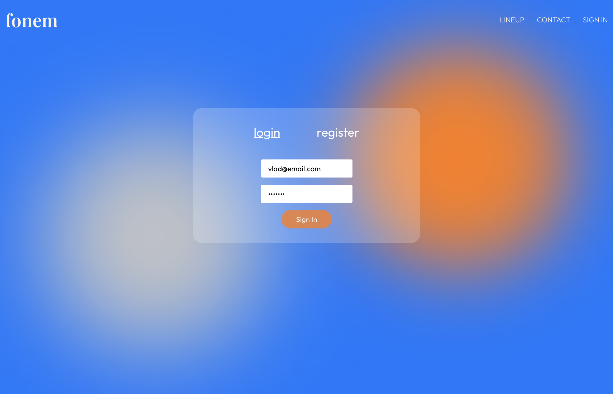
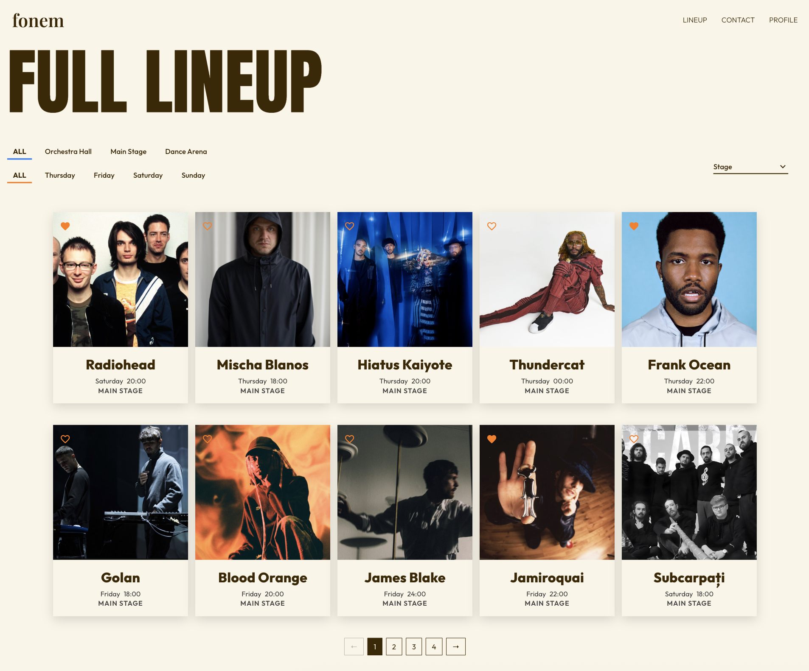
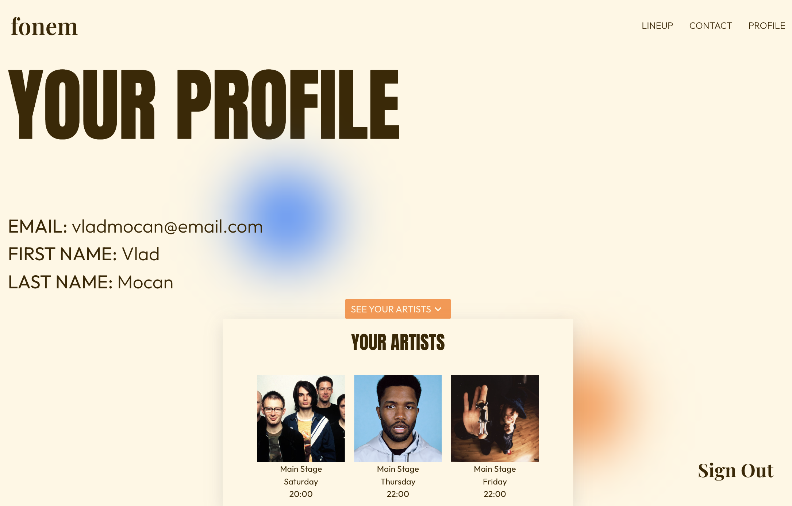
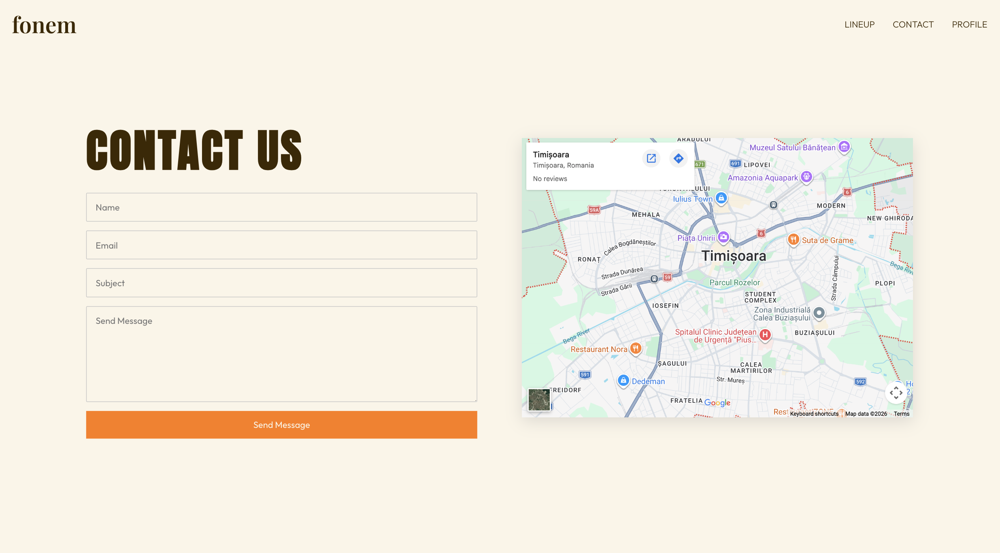

# fonM Festival App

A festival management web application built with React, Redux Toolkit, Supabase, and Vite. The app allows users to browse the festival lineup, manage their personal schedule, and contact the organizers. Admins can add or remove artists directly from the UI.

## Preview

### Home


### Login



### Lineup



### Profile



### Contact



## Tech Stack

- **React 19** — UI library
- **React Router DOM 7** — client-side routing
- **Redux Toolkit + React Redux** — global auth state management
- **Supabase** — backend (authentication, database, file storage)
- **Vite 7** — build tool and dev server
- **CSS Modules** — component-scoped styling

## Features

- **Home** — Hero section with festival name and date, plus an About section
- **Lineup** — Browse all artists with filtering by stage/day, sorting by name or day, and pagination (10 artists per page). Logged-in users can save artists to their personal schedule.
- **Login / Register** — Email/password authentication via Supabase Auth. Toggled in a single form.
- **Profile** — Displays user info and their saved schedule. Admin users can view contact messages submitted through the Contact page.
- **Contact** — Contact form that stores messages in Supabase. Includes an embedded Google Map of Timisoara, Romania.
- **Admin panel** — Users with the `admin` role can add new artists (with image upload to Supabase Storage) and delete existing ones from the Lineup page.

## Project Structure

```
src/
├── components/
│   ├── About/            # Festival "About" section on the Home page
│   ├── AdminArtistForm/  # Form for admins to add new artists
│   ├── ArtistCard/       # Card displaying artist info; supports schedule toggle and admin delete
│   ├── DateDisplay/      # Shows festival dates
│   ├── Filter/           # Stage and day filter controls for the Lineup
│   ├── Footer/           # Site-wide footer
│   ├── Hero/             # Landing hero section with festival title
│   ├── Loader/           # Full-page loading spinner
│   ├── Messages/         # Admin-only contact messages viewer
│   ├── Navbar/           # Navigation bar (adapts dark/light based on route)
│   ├── ProfileArtists/   # Displays a user's saved artists on the Profile page
│   └── ScrollToTop/      # Scrolls to top on route change
├── pages/
│   ├── Contact/          # Contact form + map
│   ├── Home/             # Hero + About
│   ├── Lineup/           # Full artist lineup with filter, sort, pagination
│   ├── Login/            # Login / register form
│   └── Profile/          # User profile and personal schedule
├── store/
│   ├── store.js          # Redux store configuration
│   └── authSlice.js      # Auth state: user, profile, logout
├── lib/
│   └── supabase.js       # Supabase client instance
├── App.jsx               # Root layout: Navbar, Outlet, Footer; handles auth session on mount
├── main.jsx              # Entry point: router setup, Redux Provider
└── index.css             # Global styles and CSS variables
```

## Supabase Schema

The app relies on the following Supabase tables and resources:

| Resource   | Type           | Description                                                               |
| ---------- | -------------- | ------------------------------------------------------------------------- |
| `artists`  | Table          | `id`, `name`, `genre`, `stage`, `day`, `time`, `description`, `image_url` |
| `profiles` | Table          | `id` (matches auth user), `first_name`, `last_name`, `role`               |
| `messages` | Table          | `name`, `email`, `subject`, `message`                                     |
| `artists`  | Storage bucket | Artist images uploaded by admins                                          |

## Getting Started

### Prerequisites

- Node.js 18+
- A Supabase project with the tables listed above

### Installation

```bash
git clone https://github.com/Vlad-Mocan/festival-app-vlad-mocan.git

cd festival-app-vlad-mocan
npm install
```

### Environment Variables

Create a `.env` file at the project root:

```env
VITE_SUPABASE_URL=your_supabase_project_url
VITE_SUPABASE_PUBLISHABLE_DEFAULT_KEY=your_supabase_key
```

### Running the App

```bash
# Development server
npm run dev

# Production build
npm run build

# Preview production build
npm run preview

# Lint
npm run lint
```

## Roles

| Role  | Permissions                                   |
| ----- | --------------------------------------------- |
| user  | See Lineup, Save artists to personal schedule |
| admin | Add/delete artists, view contact messages     |

A user is assigned the `admin` role by setting `role = 'admin'` in the `profiles` table.

## Local Storage

The app persists the following data in `localStorage` to survive page refreshes:

| Key        | Value                                              |
| ---------- | -------------------------------------------------- |
| `schedule` | JSON array of saved artist IDs                     |
| `sort`     | Active sort option for the Lineup                  |
| `filters`  | JSON object with `selectedStage` and `selectedDay` |